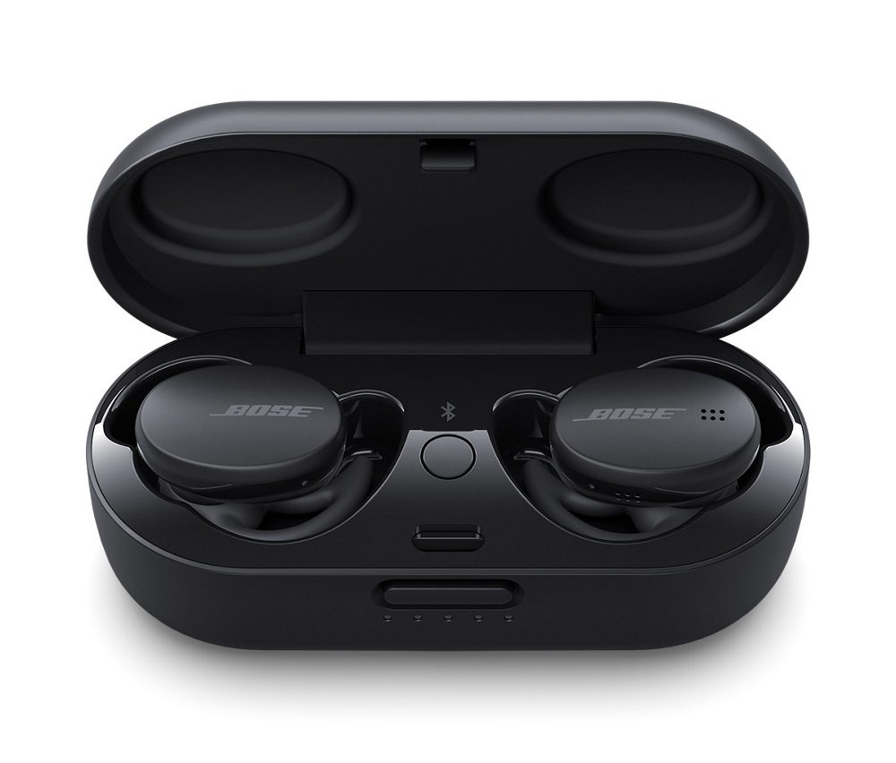

# Embedded systems Portfolio
---
## Bose Corporation
Software Engineer (2010 - Present)

### Generation 2 Earbuds

* Designed and developed sustanable charging case for truely wireless earbuds.
* Designed system level user interactions between buds and charging case.
* Supported manufacturing and End 2 End testing.
* Lead a software team from requirments gathering phase to start of production.

[View on Bose.com QuiteComfort](https://www.bose.com/en_us/products/headphones/earbuds/quietcomfort-earbuds.html#v=qc_earbuds_black)

[View on Bose.com Sports Earbuds](https://www.bose.com/en_us/products/headphones/earbuds/bose-sport-earbuds.html#v=sport_earbuds_triple_black)

 

 

